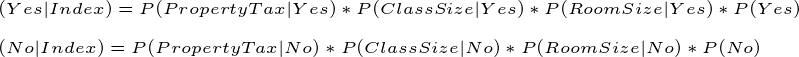

# Naive Bayes Classifier
This project implements a Naive Bayes Classifier to determine if a family would or would not buy a home in a specific location based on various factors.

# Data Set
The data set processed by the classifier was found at: http://lib.stat.cmu.edu/datasets/boston.

We ran into some formatting issues with the data which created the need for the 'formatDataSet' folder which formats the data set so it can easily be read into a matrix data frame in R. We also reduced the data set as we did not find all variables from the original data set relevant or benifical to our alogrithm. We originally scaled down the number of variables to 5 but decided to only implement the bayesian process on 3 as we had some issues with the data not being distributed in a way that lent itself well to a Naive Bayes Classifier. This is made clearer while overviewing the program itself.

In addition, the data set used contained a range of values for each category, in order to implement the classifier properly we also needed store each range of values in bins. The values for the threshold of each bin were originally based on splitting the rage of each variable into equal parts, this was eventually done away with and they were adjusted manually to get the best spread of values possible. Although we initially created thresholds for 5 variables, to limit the complexity of the scope of this project only 3 variables were used in the final implementation of the classifier. These thresholds are outlined in the tables below.

Threshold Values for Property Tax:

| Bin Label   | Threshold Value |
| ----------- | --------------- |
| Low         | <= 258          |
| High        | > 258           |

Threshold Values for Student Teacher Class Ratio:

| Bin Label   | Threshold Value |
| ----------- | --------------- |
| Small Class | <= 17           |
| Large Class | > 17            |

Threshold Values for Number of Rooms (property size):

| Bin Label   | Threshold Value |
| ----------- | --------------- |
| Small       | < 4             |
| Medium      | >= 4 & < 7      |
| Large       | >= 7            |

# Initial Model

The initial model created for our classifier was created according the criteria containted in the spreadsheet in this directory. We first selected the top ten values and then assigned them a 'yes' or 'no' value based on the thresholds contained in the spreadsheet. We found that this this process caused our model to be somewhat lopsided and decided to select other random indexes to perform the same process on; this is why the indexes are 1-10 and then become chaotic.

This still left the model somehwat lopsided, with some manual tweaking of the 'yes' and 'no' results in the model we eventually settled on an inital model that gave a good spread of 'yes' and 'no' results on the select data. The following table illustrates the version of the model that was run across the rest of our data set: (this process is explained in the next section)

| Row Number | Number of Rooms (House Size) | Property Tax | Student-Teacher Class Ratio | Yes or No |
|------------|------------------------------|--------------|-----------------------------|-----------|
| 1          | medium                       | low tax      | small class                 | yes       |
| 2          | medium                       | high tax     | large class                 | yes       |
| 3          | large                        | high tax     | large class                 | yes       |
| 4          | medium                       | high tax     | large class                 | yes       |
| 5          | large                        | high tax     | large class                 | no        |
| 6          | medium                       | high tax     | large class                 | yes       |
| 7          | medium                       | low tax      | small class                 | no        |
| 8          | medium                       | low tax      | small class                 | no        |
| 9          | medium                       | low tax      | small class                 | no        |
| 10         | medium                       | low tax      | small class                 | no        |
| 56         | large                        | high tax     | large class                 | no        |
| 99         | large                        | low tax      | large class                 | no        |
| 145        | medium                       | low tax      | small class                 | no        |
| 187        | large                        | high tax     | large class                 | yes       |
| 306        | medium                       | high tax     | large class                 | yes       |
| 346        | medium                       | low tax      | large class                 | no        |
| 369        | medium                       | low tax      | large class                 | yes       |
| 372        | medium                       | low tax      | large class                 | yes       |
| 415        | medium                       | low tax      | large class                 | yes       |
| 506        | medium                       | low tax      | large class                 | no        |

Along with assigning yes and no values to each of the indexes used in the inital model. We also needed to find the probabiliaties for each variable. The probabilaties for each variable allowed us to then apply Bayes equation and assin 'yes' and 'no' values to all of the other indexes. With each assignment of 'yes' and no the overall model was updated, making it more and more accurate (this process is also explained in the next section). Below are the initial probabilaties tables for each variable used: 

-- pu tables here

Note: as mentioned above, we initially started with the intention of using 5 variables but scaled down to 3 to simplify the process and because some of the variables were not well distributed for this use case. Improvemnts in these factors can be made in the future. If you are interested in what the probablaties for these other two variables, feel free to run the 'main.r' file and see their results.

# Applying the Model

# Results
